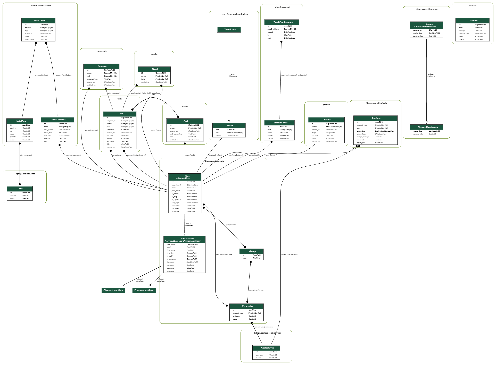

# Tick It API in DRF

**Developer: Jamie King**

💻 [Live link](https://tick-it-pp5.herokuapp.com/)

This repository contains the API set up using Django REST Framework for the Tick It front-end application ([repository here](https://github.com/jkingportfolio/ci_pp5_tick_it_react) and [live website here](https://tick-it-app-pp5.herokuapp.com/))

## Table of Contents
  - [User Stories](#user-stories)
  - [Database](#database)
  - [Technologies Used](#technologies-used)
  - [Validation](#validation)
  - [Testing](#testing)
  - [Credits](#credits)

## User Stories

The back-end section of the project focuses on its administration side and covers one user story:
- As an admin, I want to be able to create, edit and delete users, tasks, packs, comments and watches, so that I can have control over the content of the application and also remove any potential inappropriate content.

## Database

The following models were created to represent the database model structure of the application:

#### User Model

- The User model contains information about the user. It is part of the Django allauth library.
- One-to-one relation with the Profile model owner field
- ForeignKey relation with the Task model owner
- ForeignKey relation with the Pack model owner
- ForeignKey relation with the Comment model owner
- ForeignKey relation with the Watch model owner

#### Profile Model

- The Profile model contains the following fields: owner, name, job_role, created_on, updated_on and an image
- One-to-one relation between the owner field and User id field

#### Task Model

- The Task model contains the following fields: owner, created_on, title, task_body, updated_on, priority, due_date, assigned_to, completed and pack.
- ForeignKey relation with the owner field
- ForeignKey relation with the assigned_to field
- ForeignKey relation with the pack field

#### Watch Model

- The Watch model contains the following fields: owner, task and created_on
- ForeignKey relation between the owner field and the User id field
- ForeignKey relation between the task field and the Task id field

#### Comment Model

- The Comment model contains the following fields: owner, task, created_on, updated_on and comment_body
- ForeignKey relation between the ownner and User id field
- ForeignKey relation between the task and Task id field

#### Pack Model

- The Pack model contains the following fields: owner, created_on, title, pack_description, updated_on and tasks
- ForeignKey relation between to owner and User id field
- ForeignKey relation between the tasks and Task id field

##### Back to [top](#table-of-contents)

## Technologies Used

### Languages & Frameworks

- Python
- Django

### Libraries & Tools

- [Cloudinary](https://cloudinary.com/) to store static files
- [Graphviz](https://dreampuf.github.io/GraphvizOnline/) used for the database model diagram
- [Git](https://git-scm.com/) was used for version control via Gitpod terminal to push the code to GitHub
- [GitHub](https://github.com/) was used as a remote repository to store project code
- [Gitpod)](https://gitpod.io/workspaces) - a virtual IDE workspace used to build this site
- [Heroku](https://heroku.com) was used to deploy the project into live environment
- [Django REST Framework](https://www.django-rest-framework.org/) was used to build the back-end API
- [Django AllAuth](https://django-allauth.readthedocs.io/en/latest/index.html) was used for user authentication
- [Psycopg2](https://www.psycopg.org/docs/) was used as a PostgreSQL database adapter for Python
- [ElephantSQL](https://www.elephantsql.com/) – deployed project on Heroku uses an ElephantSQL database

##### Back to [top](#table-of-contents)

## Validation

### Python Validation

PEP8 was unavailable at the time of creating this project so pycodestyle was used instead to continually check all Python code for errors and warnings.

[Pycodestyle](https://pypi.org/project/pycodestyle/) - Description

## Testing

The following tests were carried out on the app:
1. Manual testing of user stories
2. Automated testing

### Manual testing of user stories

- As an admin, I want to be able to create, edit and delete the users, posts, comments and likes, so that I can have a control over the content of the application and remove any potential inappropriate content

**Test** | **Action** | **Expected Result** | **Actual Result**
-------- | ------------------- | ------------------- | -----------------
User | Create, update & delete user | A user can be created, edited or deleted | Works as expected
User | Change permissions | User permissions can be updated | Works as expected
Profile | Create, update & delete | User profile can be created, edited or deleted | Works as expected
Task | Create, update & delete | A Task can be created, edited or deleted | Works as expected
Comment | Create, update & delete | A comment can be created, edited or deleted | Works as expected
Watch | Create & delete |  A Watch relationship between a Task and a User can be created or deleted | Works as expected
Pack | Create & delete | A Pack can be created, edited or deleted | Works as expected

In addition, tasks, comments, packs and watches can be created by logged-in users only. Users can only update or delete the content which was created by themselves.

Screenshots - USER

    

Create user

    
     
    
     
    
     
    

Screenshots - PROFILE

    

Update profile

    
     
    
     
    
     
    

    

Delete profile

    
     
    
     
    
     
    
     
    

Screenshots - TASK

    

Create task

    
     
    
     
    
     
    

    

Update task

    
     
    
     
    

    

Delete task

    
     
    
     
    
     
    

Screenshots - COMMENT

    

Create comment

    
     
    
     
    
     
    

    

Update comment

    
     
    
     
    
    v
    

    

Delete comment

    
     
    
     
    
     
    

Screenshots - PACK

    

Create pack

    
     
    
     
    
     
    

    

Edit pack

    
     
    
     
    
     
    

    

Delete pack

    
     
    
     
    
     
    

Screenshots - WATCH

    

Create - Watch Task

    
     
    
     
    

    

Delete - UnWatch Task - DJANGO ADMIN

    
     
    
     
    
     
    

### Automated testing

Automated testing was done using the Django Rest Framework APITestCase.

- Tests summary

Individual app report

Combined report

##### Back to [top](#table-of-contents)

## Credits

### Code

This project was created based on the Code Institute's Django REST API walkthrough project ['Moments'](https://github.com/Code-Institute-Solutions/drf-api).

##### Back to [top](#table-of-contents)